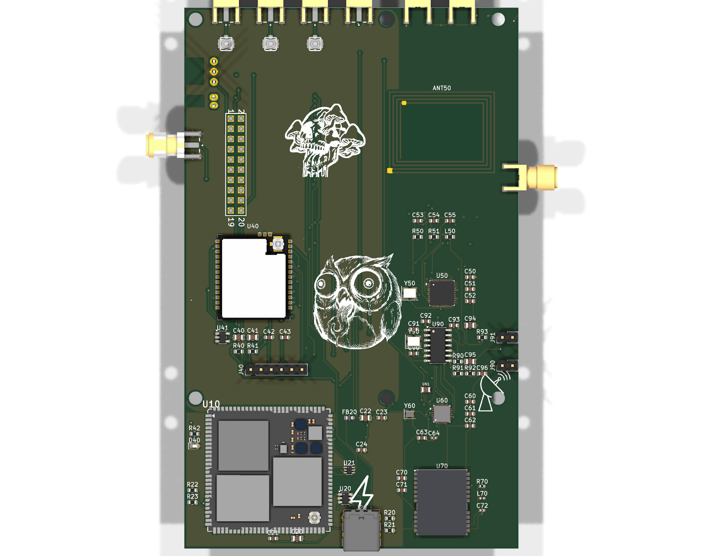

# SnowOwl — v1 (original board) · ARCHIVED

This folder is the **record of the original SnowOwl board** — the one in the renders
below and in the repository's top-level README. It is kept read-only for reference while
the ground-up remake happens in [`../v2-compact/`](../v2-compact/).

> ⚠️ The original design was only ever published as **renders** — no KiCad source for v1
> was committed to this repo. So this archive holds the images, not `.kicad_*` files.

## Renders

| Front | Back |
|---|---|
|  |  |

## Why we're remaking it

v1 packs the full radio/reader set onto a single large board, but components ended up
spread out, which forces long traces across the whole board and makes routing hard. v2
keeps every capability but **places each subsystem deliberately** (antennas on edges, a
shared SPI spine, big modules on the back) and splits the design into a clean 2-board
stack. See [`../v2-compact/PLACEMENT.md`](../v2-compact/PLACEMENT.md).
