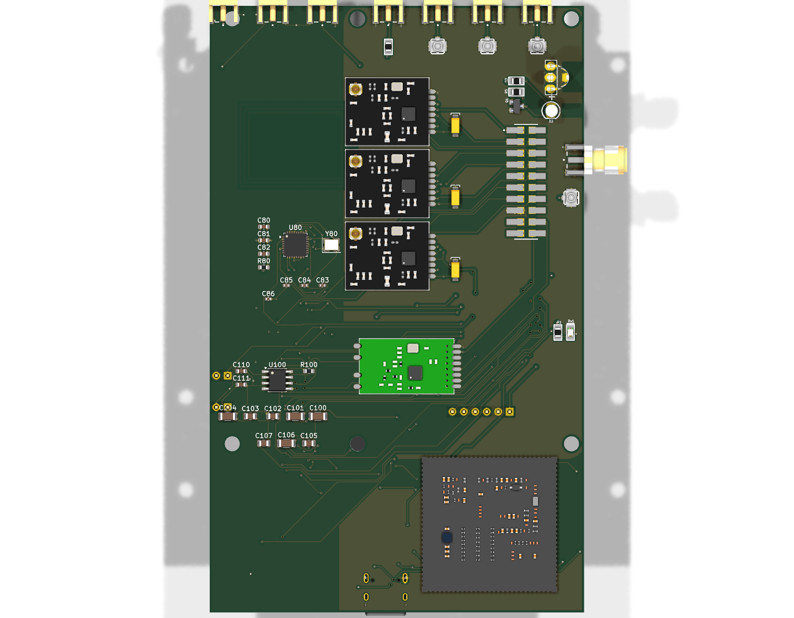

# 🦉 ESP32-SnowOwl — Hardware

KiCad 10 design for the SnowOwl shield and the extended main board.

## Renders

| Front | Back |
|---|---|
|  |  |

## Shield highlights

- **ESP32-C5-WROOM-1U** — dual-band **2.4 / 5 GHz Wi-Fi 6** co-processor (adds the 5 GHz band the S3 lacks); own U.FL antenna + **AP7361C-3.3** LDO rail, UART-linked to the S3.
- **Luckfox RV1106 (Core1106)** ARM Linux SoM — self-powered from its **own USB-C** (isolated from the main board's supply).
- **PN532 NFC** (13.56 MHz, 27.12 MHz clock) on a dedicated I²C bus owned by the ESP32-S3.
- **HTRC110 125 kHz LF RFID** front-end + coil connector.
- **iButton / 1-Wire** contact interface.
- **SX1262 LoRa** (+ Johanson integrated match) and **CC1200** high-performance Sub-GHz, alongside the classic CC1101.
- **3× nRF24L01+** (2.4 GHz) and **NEO-M9N** GPS.
- **W25Q128** 16 MB external flash for captures/logs.
- Power hardening: bulk + per-rail decoupling capacitors; **USBLC6** USB ESD protection.
- Mates to the main board via the existing 20-pin stack header; pogo/standoff holes kept clear for a flat stack.

## Stackup (4-layer)

| Layer | Role |
|---|---|
| `F.Cu`  | Signal |
| `In1.Cu` | **GND plane** |
| `In2.Cu` | **3V3 plane** |
| `B.Cu`  | Signal |

Dedicated planes give every radio a solid return path and a quiet supply — the single biggest win for multi-radio RF behaviour. Standard 4-layer fabrication (e.g. JLCPCB) adds only a few dollars per unit over 2-layer.

## Status

Placement and power planning are complete; final signal routing is in progress. The RF nets (Sub-GHz, NFC coil, GPS) are intentionally left for short, matched hand-routing.

> Full KiCad source files are being tidied for publication — open an issue if you'd like them sooner.
